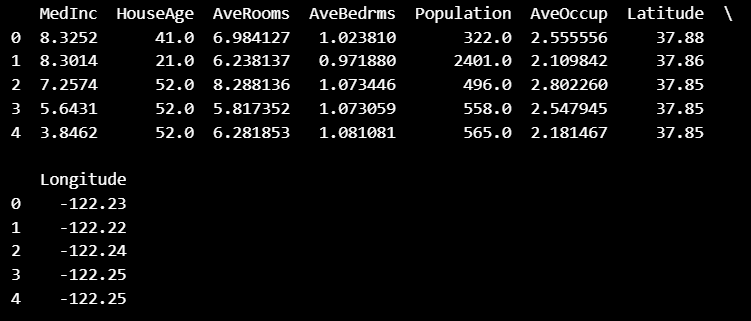
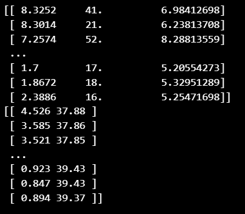
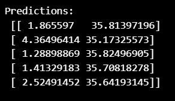

# SGD-Regressor-for-Multivariate-Linear-Regression

## AIM:
To write a program to predict the price of the house and number of occupants in the house with SGD regressor.

## Equipments Required:
1. Hardware – PCs
2. Anaconda – Python 3.7 Installation / Jupyter notebook

## Algorithm
1.Load California housing data, select three features as X and two target variables as Y, then split into train and test sets.

2.Standardize X and Y using StandardScaler for consistent scaling across features.

3.Initialize SGDRegressor and wrap it with MultiOutputRegressor to handle multiple targets.

4.Train the model on the standardized training data.

5.Predict on the test data, inverse-transform predictions, compute mean squared error, and print results.

## Program:
```
/*
Program to implement the multivariate linear regression model for predicting the price of the house and number of occupants in the house with SGD regressor.
Developed by: Bharath Raj P
RegisterNumber: 212223230031
*/

import numpy as np
from sklearn.datasets import fetch_california_housing
from sklearn.linear_model import SGDRegressor
from sklearn.multioutput import MultiOutputRegressor
from sklearn.model_selection import train_test_split
from sklearn.metrics import mean_squared_error
from sklearn.preprocessing import StandardScaler
import pandas as pd
data = fetch_california_housing()
df = pd.DataFrame(data.data, columns=data.feature_names)
print(df.head())
x = data.data[:, :3]
y = np.column_stack((data.target, data.data[:, 6]))
print(x)
print(y)
x_train, x_test, y_train, y_test = train_test_split(x, y, test_size=0.2)
scaler_x = StandardScaler()
scaler_y = StandardScaler()
x_train = scaler_x.fit_transform(x_train)
x_test = scaler_x.transform(x_test)
y_train = scaler_y.fit_transform(y_train)
y_test = scaler_y.transform(y_test)
sgd = SGDRegressor(max_iter=1000, tol=1e-3)
multi_output_sgd = MultiOutputRegressor(sgd)
multi_output_sgd.fit(x_train, y_train)
y_pred = multi_output_sgd.predict(x_test)
y_pred = scaler_y.inverse_transform(y_pred)
y_test = scaler_y.inverse_transform(y_test)
mse = mean_squared_error(y_test, y_pred)
print("Mean Squared Error:", mse)
print("\nPredictions:\n", y_pred[:5])
```

## Output:
## Dataset :


## X and Y values:


## MSE:


## Predicted value:



## Result:
Thus the program to implement the multivariate linear regression model for predicting the price of the house and number of occupants in the house with SGD regressor is written and verified using python programming.
